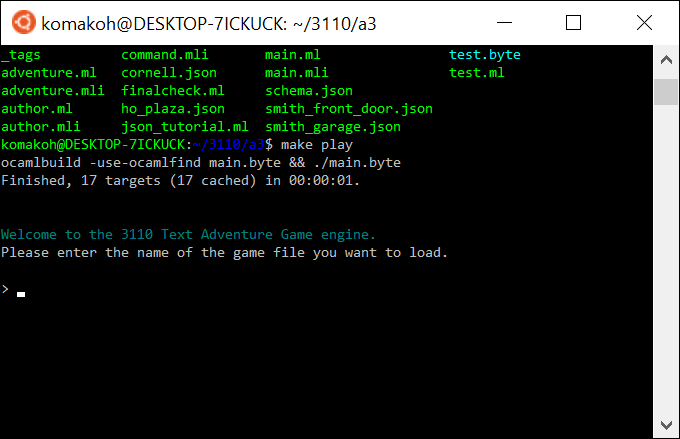
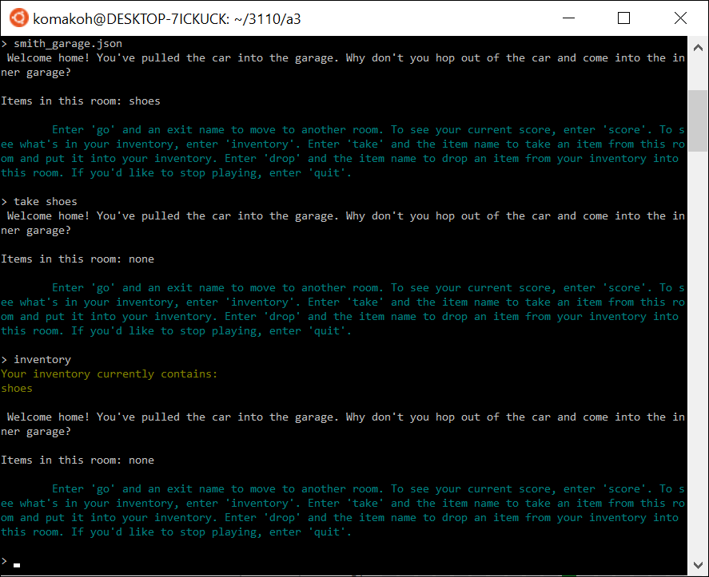
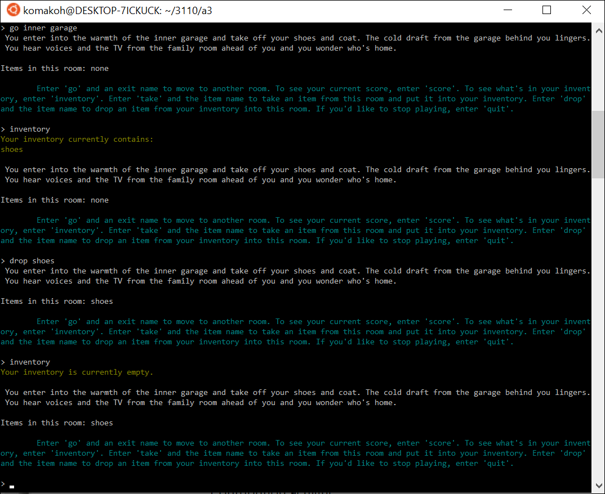
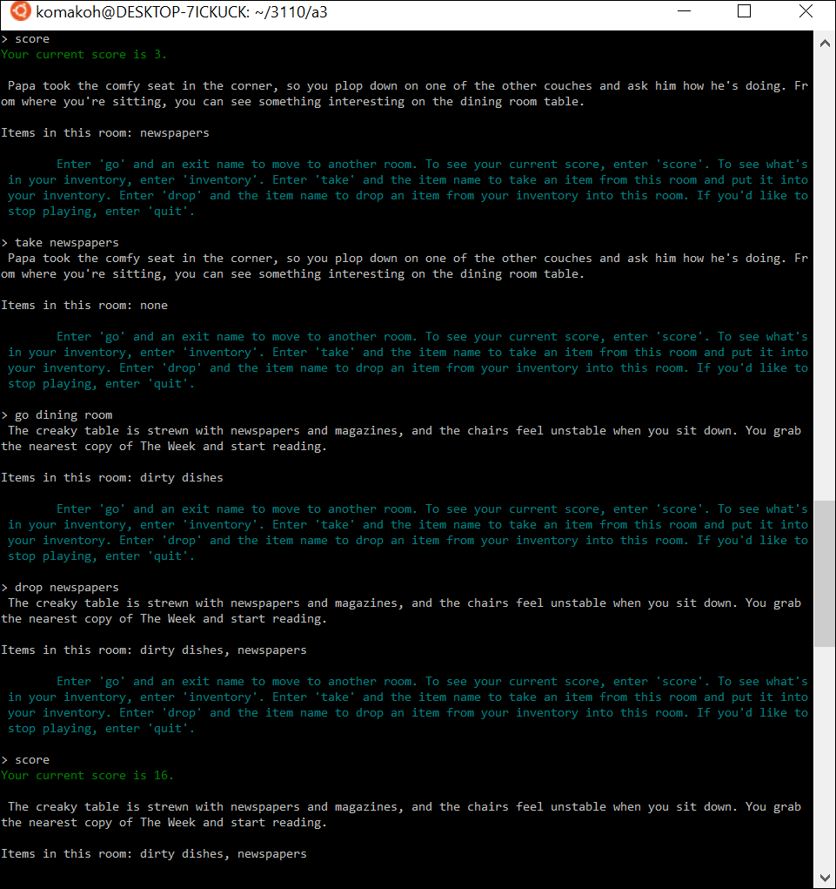
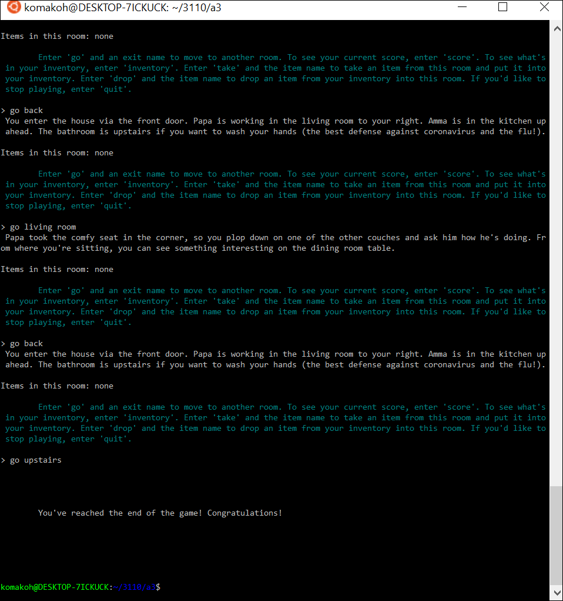

# Adventure Game

*Source code is available upon request, but could not be included here as Cornell's Department of Computer Science owns the starter code.*

A data-driven text adventure game written in OCaml for Cornell's functional programming course (CS 3110). This project was made to fit certain design specifications outlined in the assignment prompts linked below:  
https://www.cs.cornell.edu/courses/cs3110/2020sp/a2/  
https://www.cs.cornell.edu/courses/cs3110/2020sp/a3/

The game can "play" any JSON adventure file with the appropriate format. A sample JSON file has been included [here](smith_garage.json).

Running "make play" within the project file starts the game engine and players are prompted to input the name of their desired adventure file.  

Upon inputting the desired JSON file, players are taken to the entry room indicated in the JSON file. In this example adventure, it's the garage. Each time a command is run, the game provides a helpful rundown of available commands and information about the player's current location. This includes the room description and the items currently in the room. For example, the entry room for this adventure ("garage") contains shoes.  

Players can pick up items and add them to their inventory by entering "take" and the name of the item in the room they'd like to pick up. The item is then added to the player's inventory, which a player can confirm by running the command "inventory".  

Rooms are accessed using the command "go" and an exit name. Each room can have multiple exit names that lead to it. For example, "back" was a strategically included exit name in this adventure, so that players could use the command "go back" in any room to retreat towards the entry room.  

Players can also "drop" items from their inventory into the current room.  

Players earn points by exploring the rooms in the game and by dropping items in the correct room. Dropping an item in the correct room earns a player 10 points, while exploring new rooms earns a variable number of points, depending on the room. Players can check their current score with the command "score". In the example below, the player earned 3 points for entering the "dining room" for the first time and then 10 points for dropping the newspapers in the dining room (which was the target room for this item).  

Players win the game by entering all of the rooms and dropping all of the items in their correct rooms.  

Beyond the guide that is displayed each time a command is run, the game also includes a variety of error messages to guide players to use the commands correctly.  

